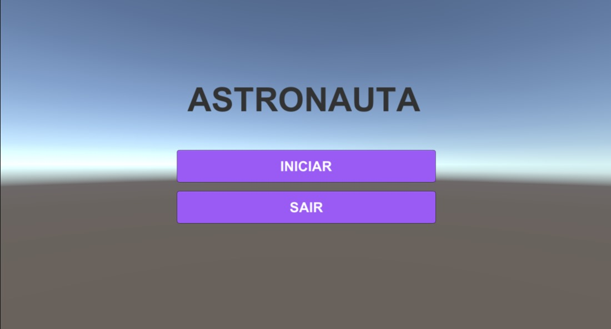
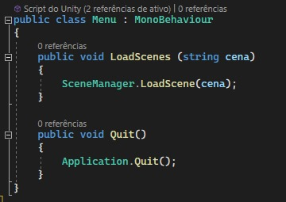
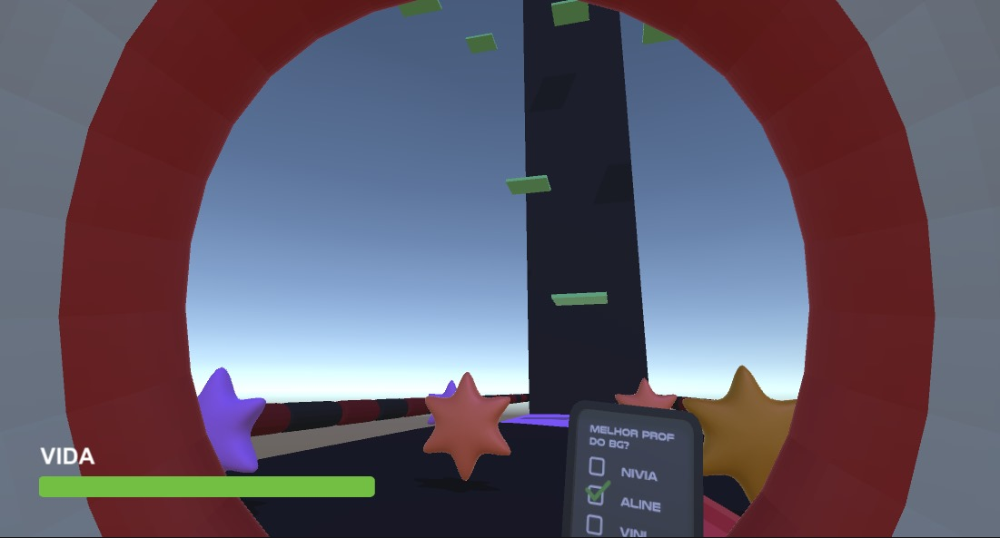

# TROCA DE CENA

## MENU
Ao inicio de tudo criamos uma nova cena e demos atribuimos o nome "Menu", logo após isso, adicionamos 2 btn's personalizados a cena, juntamente com o nome do game, tudo viazando deixar mais intuitivo e simples para a visão do jogador

 

Para que tudo ficasse funcional, criei um script para as cenas que seriam criadas, e no arquivo, codei o código para a troca de cena, criando assim duas funções a serem executadas nos btn's, uma para carregar o jogo, e a outra para fecha-lo

 

## JOGO
No jogo, utilizei do canvas para criar um barra de vida ao nosso personagem. Depois que adicionamos a barra de vida ao arquivo, transformamos ela em um frame para ser mais facíl de se trabalhar, após isso configuramos ela para ser possível utliza-la em nosso código, setando um valor máximo de 1, fizemos com que toda vez que o personagem colidisse com uma estrela Vermelha, ele perdesse -0,1 de vida, e que quando a barra de vida fosse =< 0, ele nos levaria até a tela de derrota.

 
